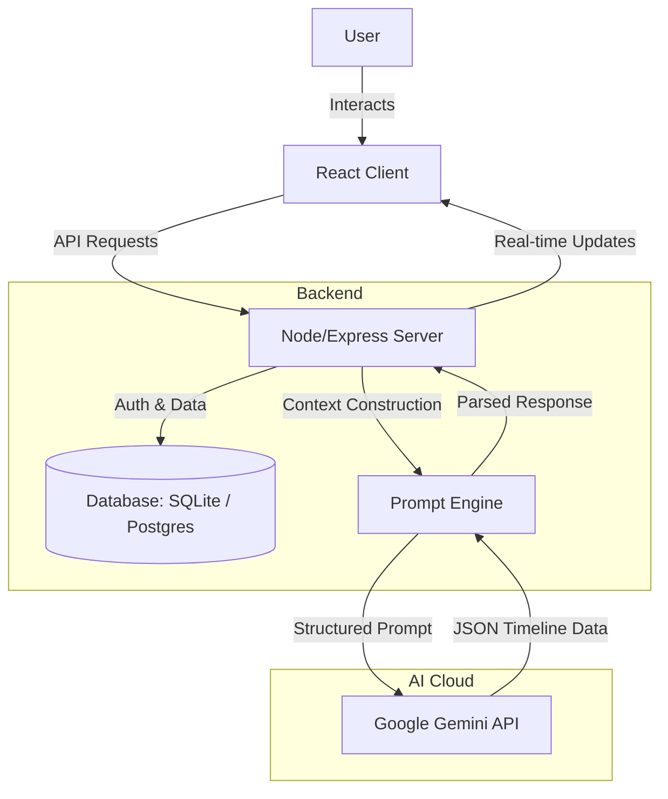

<p align="center">
  
</p>

<h1 align="center">🔮 WhatIF — AI-Driven Cognitive Time Simulator</h1>

<p align="center">
  <strong>Experience the future before you choose it.</strong>
</p>

<p align="center">
  <a href="https://what-if-pc.vercel.app/" target="_blank">
    
  </a>
  <a href="https://www.youtube.com/watch?v=LTtSO9-LDhg" target="_blank">
    
  </a>
</p>

<p align="center">
  
  
  
  
</p>

---

### 🌟 Overview

**WhatIF** is an AI-powered cognitive decision-making simulator that generates and visualizes multiple parallel future timelines based on critical choices you make today. Leveraging **Google Gemini AI**, it projects personalized, multi-dimensional outcomes across emotional, financial, career, and relationship spectrums.

It's designed to reduce decision anxiety and democratize scenario planning, showing you the long-term impacts of your choices before you take the leap.

---

## ✨ Features

- **🧠 Multi-Timeline Generation** — Get 3-5 distinct future scenarios (Optimistic, Pragmatic, Pessimistic) for any life decision powered by Gemini.
- **👤 Personalized Simulations** — The simulator factors in your risk tolerance, age, location, priorities, and unique life situation.
- **📊 Interactive Metrics** — Track and compare emotional, financial, career, and relationship scores over time.
- **⚖️ Side-by-Side Comparison** — Compare up to 3 timelines concurrently to weigh trade-offs and potential outcomes.
- **🔄 Dynamic Branching (Follow-up Decisions)** — Inject subsequent decisions into any generated timeline to see how paths evolve dynamically.
- **🔐 Secure Session & Auth** — Full guest session persistence and user login/signup with secure JWT-based authentication.
- **🎨 Immersive Glassmorphism UI** — A premium, responsive interface featuring ambient background animations, dark/light modes, and interactive sound effects.

---

## 📸 App Showcase

<table align="center">
  <tr>
    <td align="center"><br /><sub>01. Landing Page</sub></td>
    <td align="center"><br /><sub>02. Features</sub></td>
    <td align="center"><br /><sub>03. Sign in</sub></td>
  </tr>
  <tr>
    <td align="center"><br /><sub>04. Alias (if guest)</sub></td>
    <td align="center"><br /><sub>05. Dashboard/Home page</sub></td>
    <td align="center"><br /><sub>06. Prompt Area</sub></td>    
  </tr>
  <tr>
    <td align="center"><br /><sub>07. Interactive Graph</sub></td>
    <td align="center"><br /><sub>08. Side-by-Side Comparison</sub></td>
    <td align="center"><br /><sub>09.  Follow-up Branching</sub></td>
  </tr>
  <tr>
    <td align="center"><br /><sub>10. New Child Timeline</sub></td>
    <td align="center"><br /><sub>11. Final Timeline visualisation</sub></td>
    <td align="center"><br /><sub>12. Model selection</sub></td>
  </tr>
</table>

## 🛠️ Tech Stack

- **Frontend:** React (TS), Vite, Zustand (State Management), React Query (Data Fetching), Glassmorphism UI
- **Backend:** Node.js, Express, Prisma (ORM)
- **Database:** SQLite (local development), Supabase PostgreSQL (production)
- **AI Core:** Google Gemini API (supporting latest Gemini models with fallback configurations)
- **Hosting:** Vercel (Frontend), Render (Backend)

---

## 🏗️ System Architecture

The client-server architecture utilizes a structured Prompt Engine to leverage Generative AI:



---

## 🧠 Gemini Integration & Prompt Engineering

WhatIF leverages the semantic and structured capabilities of Google Gemini to model life pathways.

### 1. Context-Aware Construction
Instead of basic prompts, we assemble a rich context containing:
* **User Profile**: Risk profile, priorities, age, location, and relationship status.
* **Current State**: Cumulative results of previous timeline decisions.
* **Decision Matrix**: The specific choice to simulate.

### 2. Multi-Timeline Modeling
Gemini generates **3 archetypal scenarios** simultaneously:
* **The Optimistic Path:** High-risk, high-return choices.
* **The Pragmatic Path:** Realistic, balanced, and sustainable choices.
* **The Pessimistic Path:** Stagnant, low-risk, or worst-case choices.

### 3. Structured JSON Schema
Using Gemini's structured output mode, we ensure valid and consistent JSON payloads:
```json
{
  "year": 1,
  "event": "Description of event...",
  "impact_score": 7,
  "category": "Career"
}
```

---

## 🌍 Potential Impact

* **Democratizing Foresight:** Brings strategic planning tools down to personal life choices.
* **Mitigating Anxiety:** Visualizing different outcomes helps reduce choice paralysis and helps users take bold, informed pivots.
* **Educational & Personal Growth:** Great for career counseling, financial planning, and habit visualizers.

---

## 🚀 Getting Started

### Prerequisites
- Node.js 18+
- npm or yarn
- Gemini API Key ([Get it on Google AI Studio](https://aistudio.google.com/apikey))

### Quick Setup

#### 1. Clone the repository
```bash
git clone https://github.com/prateekiitg/whatif.git
cd whatif
```

#### 2. Configure & Start Server
```bash
cd server
npm install
cp .env.example .env
# Edit .env and enter your GEMINI_API_KEY
npx prisma migrate dev
npm run dev
```

#### 3. Configure & Start Client
In a new terminal:
```bash
cd client
npm install
npm run dev
```

#### 4. Access the App
Open [http://localhost:5173](http://localhost:5173) in your browser.

---

## 📦 Project Structure

```
whatif/
├── client/                 # React frontend (Vite + TS)
│   ├── src/
│   │   ├── components/     # UI elements
│   │   ├── pages/          # Full page views
│   │   ├── stores/         # Zustand global states
│   │   └── services/       # API integration
│   └── public/             # Static icons & sounds
│
├── server/                 # Express backend
│   ├── src/
│   │   ├── routes/         # Express endpoints
│   │   ├── services/       # AI logic / Prompt engines
│   │   └── middleware/     # JWT Auth & error filters
│   └── prisma/             # SQLite/PostgreSQL schemas
│
└── DEPLOY.md               # Production deployment guide
```

---

## 🔑 Environment Configuration

### Backend (`/server/.env`)

| Variable | Description |
| :--- | :--- |
| `PORT` | Server port (default: `3001`) |
| `DATABASE_URL` | Local SQLite or Supabase Postgres URI |
| `JWT_SECRET` | Secret token for JWT encryption |
| `GEMINI_API_KEY` | Google AI Studio Developer Key |

For hosting this application on Render and Vercel, check the step-by-step [DEPLOY.md](DEPLOY.md) file.
